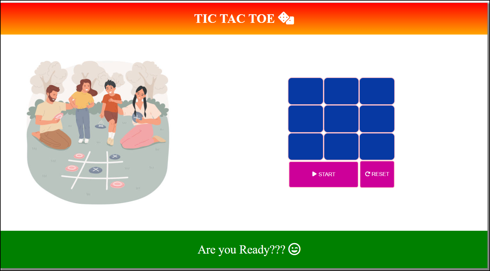

# Tic-Tac-Toe

Welcome to my Tic Tac Toe game! This project implements the classic Tic Tac Toe game in JavaScript, allowing two players to compete against each other.

<h1>Table of Contents</h1>
<ul>
  <li>Features</li>
  <li>Tech Stack</li>
  <li>Demo</li>
  <li>Installation</li>
</ul>
<h2>Features</h2>
<ul>
  <li><b>Two-player mode:</b> Allows two players to take turns playing against each other.</li>
  <li><b>Interactive interface:</b> Provides a simple and intuitive interface for players to make their moves.</li>
  <li><b>Win detection:</b> Automatically detects when a player has won or if the game ends in a draw.</li>
</ul>

<h2>Tech Stack</h2>
<ul>
  <li>HTML</li>
  <li>CSS</li>
  <li>JS</li>
</ul>

<h2>Demo</h2>

<h2>Installation</h2>
To install and run this game locally, follow these steps:
<li><b>Clone the repository:</b></li>
<code>git clone https://github.com/prasannavb/Tic-Tac-Toe.git</code> 
<li><b>Navigate to the project directory:</b></li>
<code>cd tic-tac-toe</code> 
<li>Open the <code>index.html</code> file in your web browser.</li>
